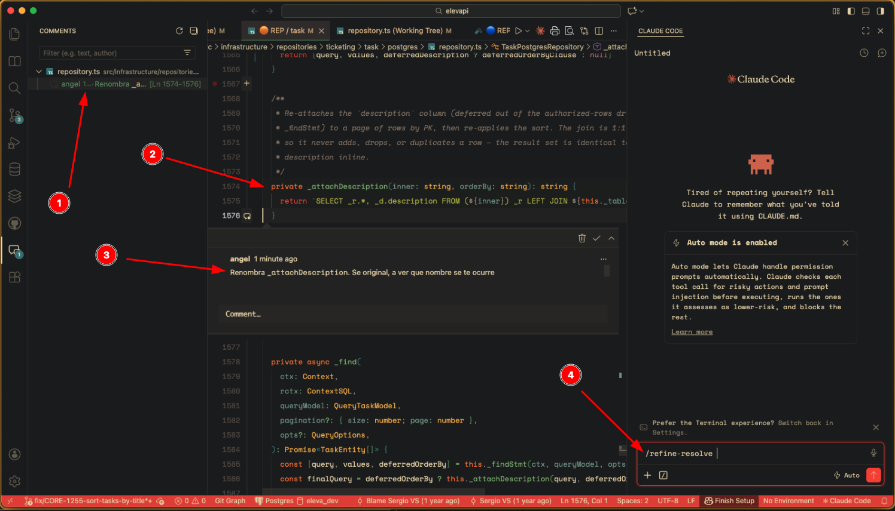
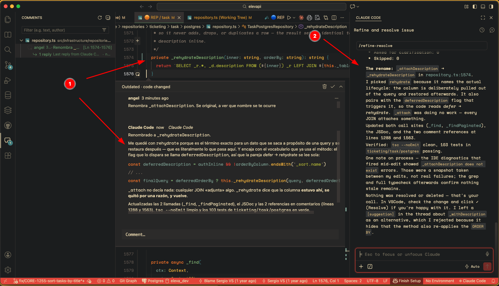

# Refiner

Extensión de VSCode con hilos de comentarios inline que Claude Code lee y responde.

## Instalación

Necesitas las dos mitades: la **extensión** (la UI) y las **skills** (el lado de Claude Code).

### 1. La extensión

Genera el `.vsix`:

```sh
npm install
npm run package     # -> refiner-0.0.1.vsix
```

Instálalo:

```sh
code --install-extension refiner-0.0.1.vsix
```

O en VSCode: panel **Extensions** → menú `…` → **Install from VSIX…**

### 2. Las skills

Paleta de comandos → **Refiner: Install Claude Code Skills**.

Copia `/refine-review` y `/refine-resolve` a `~/.claude/skills/` (van dentro del `.vsix`, no hay que descargar nada más). Reinicia la sesión de Claude Code después: las skills se descubren al arrancar.

## Uso

### 1. Deja un comentario

Pasa el ratón por el margen izquierdo de cualquier línea → aparece un **`+`** → clic, escribe y envía.



### 2. Claude lo aplica

Lanza `/refine-resolve`: lee tus comentarios abiertos, hace los cambios y responde en cada hilo. Nunca resuelve — el ✓ lo das tú cuando lo has verificado.



### 3. Cierras el hilo

**Responder**, **Resolver / Reabrir**, **Editar / Borrar**: botones en el propio hilo.

En sentido inverso, `/refine-review` hace que Claude revise el diff actual y deje él los hilos, que aparecen inline igual.

Todo se guarda en `.refiner/comments.json`.

## Ignorar `.refiner/` en todos tus repos

Los comentarios son tuyos, no del proyecto: no tienen por qué acabar en el repo de nadie. En vez de tocar el `.gitignore` de cada uno, ignóralo una sola vez para todo tu ordenador con el **gitignore global**.

Git ya lee `~/.config/git/ignore` por defecto (desde la 2.32), así que basta con añadir la línea:

```sh
mkdir -p ~/.config/git
echo '**/.refiner/' >> ~/.config/git/ignore
```

Compruébalo desde cualquier repo con comentarios:

```sh
git check-ignore -v .refiner/comments.json
# ~/.config/git/ignore:1:**/.refiner/    .refiner/comments.json
```

Si no imprime nada, no se está aplicando. Mira si tienes un `core.excludesFile` apuntando a otro sitio y añade la línea allí:

```sh
git config --global core.excludesFile     # vacío = se usa ~/.config/git/ignore
```

Dos avisos:

- El gitignore global **solo afecta a tu máquina**. Tus compañeros no lo heredan — si en tu equipo nadie quiere versionar los comentarios, que cada uno haga lo mismo, o añadid `.refiner/` al `.gitignore` del repo.
- Git no ignora lo que ya está trackeado. Si algún `.refiner/comments.json` ya está commiteado, sácalo primero con `git rm --cached -r .refiner/`.

> Si prefieres lo contrario — compartir los comentarios con tu equipo — no ignores nada y commitea `.refiner/comments.json` como un archivo más. El formato es JSON estable y legible en un diff.

## Desarrollo

```sh
npm install
```

Abre la carpeta en VSCode y pulsa **F5**. Se abre una segunda ventana ("Extension Development Host") con Refiner cargado. Busca `[Refiner] activated for …` en la Debug Console.

Hay dos configuraciones de lanzamiento:
- **Run Refiner Extension** — el flujo normal, con Claude Code disponible.
- **Run Refiner (isolated — no Claude Code)** — solo para depurar; desactiva el resto de extensiones, así que no sirve para probar el ciclo de comentarios.

Para las skills, symlink en vez de copiarlas, así los cambios aplican al momento:

```sh
ln -sfn "$PWD/skills/refine-review"  ~/.claude/skills/refine-review
ln -sfn "$PWD/skills/refine-resolve" ~/.claude/skills/refine-resolve
```

`npm: watch` recompila solo al pulsar F5. O `npm run compile` a mano.

## Desinstalar

```sh
code --uninstall-extension refiner-dev.refiner
rm ~/.claude/skills/refine-review ~/.claude/skills/refine-resolve
```

## Configuración

- `refiner.authorName` — nombre con el que se firman tus comentarios (por defecto, tu usuario del sistema).

### Quitar el scrollbar de los comentarios largos

VSCode limita cada cuerpo de comentario a `20em` de alto (unas 20 líneas): lo que sobra queda dentro de una barra de scroll vertical en la propia burbuja. Con Refiner te lo encuentras más que de costumbre, porque las skills piden cuerpos bien formateados: párrafos separados, bloques de código, listas. Ese formato pasa de 20em enseguida.

El tope se desactiva con un setting de **VSCode**, no de Refiner (fíjate en que no lleva el prefijo `refiner.`). En tus settings de usuario o los del workspace:

```json
{
  "comments.maxHeight": false
}
```

Es un booleano, por defecto `true`, disponible desde VSCode 1.78 (abril de 2023).

## Contrato de `.refiner/comments.json`

Para que Claude Code participe:

1. **Leer**: cada `thread` está anclado a un `file` y a un `range` de líneas (1-based). Un hilo te espera si su `status` es `"open"` y su último comentario tiene `role: "user"`.
2. **Responder**: añade un comentario al array `comments` del hilo con `"role": "assistant"`. La extensión lo muestra inline al instante.
3. **Resolver** (opcional): pon `"status": "resolved"`.

```json
{
  "id": "c-<unique>",
  "author": "Claude Code",
  "role": "assistant",
  "body": "Respuesta en Markdown.",
  "createdAt": "2026-07-17T12:00:00.000Z"
}
```

- `role`: `"user"` para humanos, `"assistant"` para Claude Code.
- **No escribas el campo `anchor`.** Lo añade la extensión para seguir el comentario cuando el código se mueve. Si el código anclado desaparece, el hilo se marca **"Outdated · code changed"** en vez de apuntar a una línea equivocada. **Refiner: Re-anchor Comments to Current Code** fuerza una pasada.

## Estructura

| Ruta | Para qué |
| --- | --- |
| `src/extension.ts` | Activación, CommentController, comandos, re-anclaje. |
| `src/store.ts` | Lee/escribe/vigila `.refiner/comments.json`. |
| `src/anchor.ts` | Anclaje por contenido (captura + relocalización). |
| `src/types.ts` | Modelo de datos en disco (el contrato compartido). |
| `skills/refine-review/`, `skills/refine-resolve/` | Las skills de Claude Code. |
